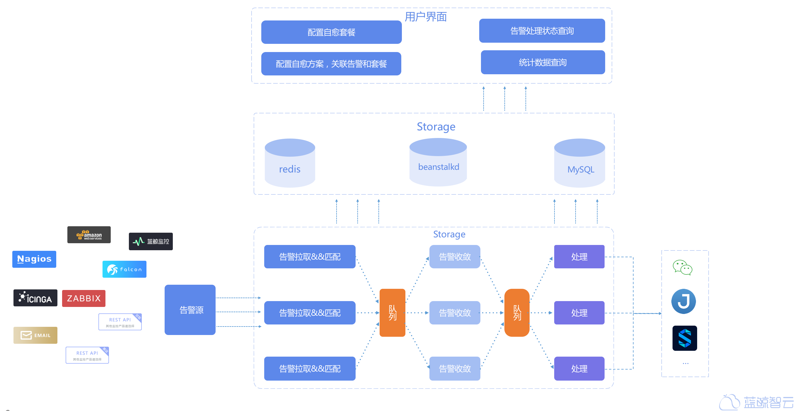
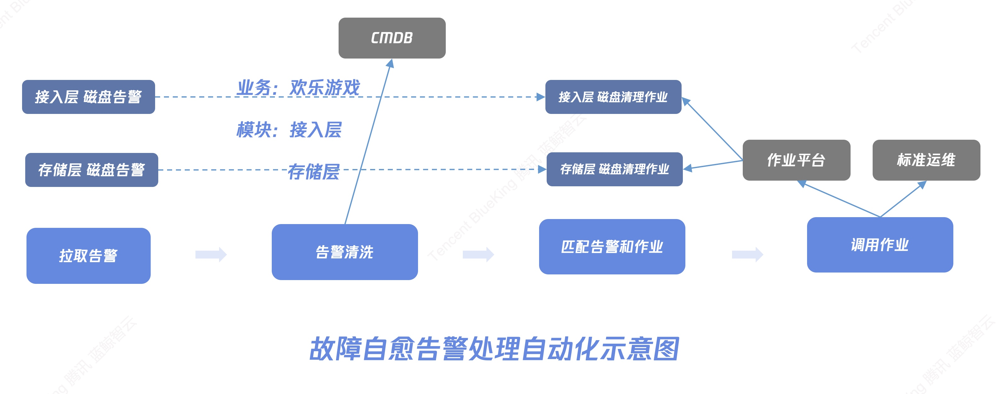
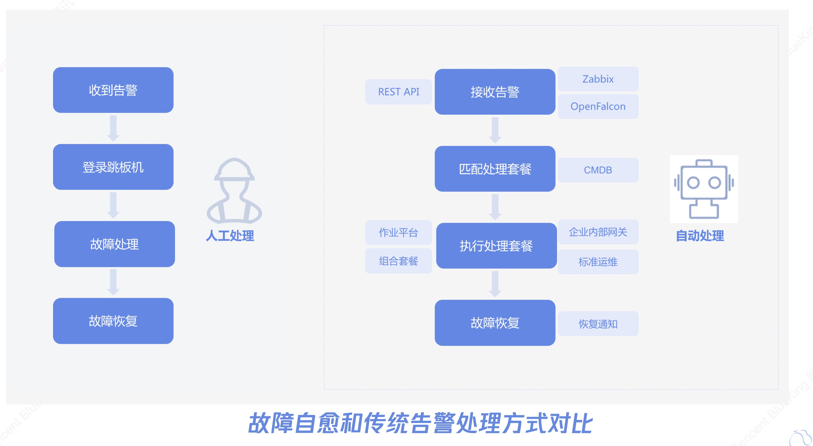

# 产品架构图
故障自愈集成行业主流开源监控产品或以 REST API 方式获取企业监控产品的告警，**匹配告警设置的执行套餐**，同时通过 **收敛防御** 实现 **在安全的前提下完成告警处理的无人值守**。

## 1. 故障自愈在蓝鲸中的位置

在蓝鲸的体系架构中，故障自愈位于 **应用场景 SaaS 层**，通过蓝鲸 PaaS 平台的 ESB（API 网关）调用 配置平台（CMDB）、作业平台、标准运维等产品的 API，实现告警的自动化处理。

## 2. 故障自愈产品架构图

故障自愈的告警拉取模块，周期性或通过 **回调** 方式从各大监控系统中获取告警，通过调用蓝鲸 CMDB 的 API **解析** 告警所属的业务、模块，查询该业务、模块在故障自愈配置的处理动作，经过 **告警收敛** 模块的过滤以确认没有大批量相同属性（如同业务、机房等），最后执行对应的 **处理动作**，告警恢复，业务恢复正常。

为了便于理解，下图为欢乐游戏业务的接入层、存储层发生磁盘使用率告警的自动化处理示意图。

将 **人的处理经验沉淀到自动化工具** 上，故障自愈，重新定义告警的处理方式！

