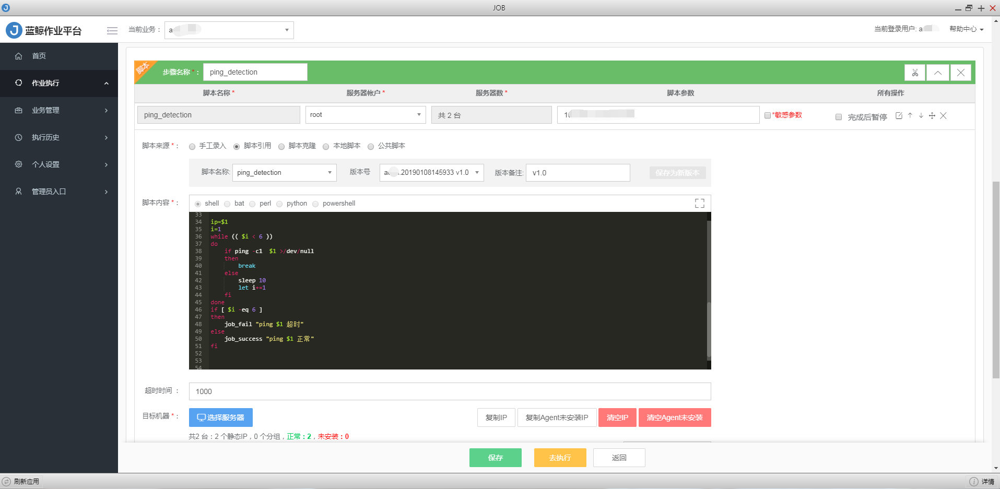
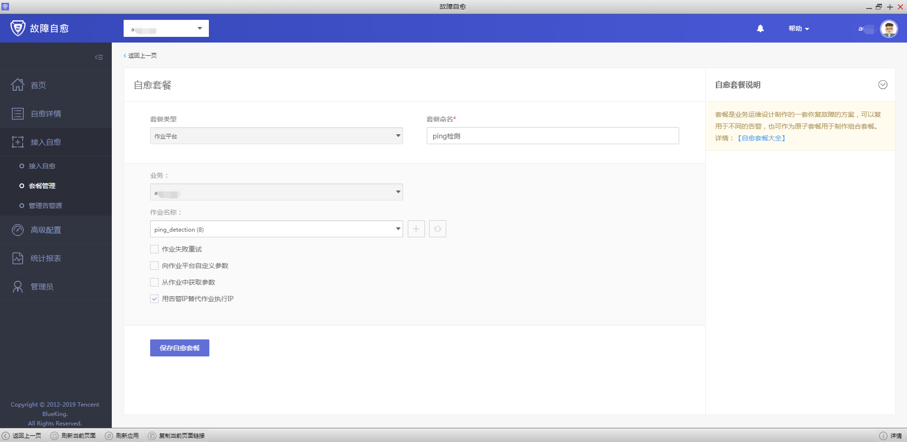
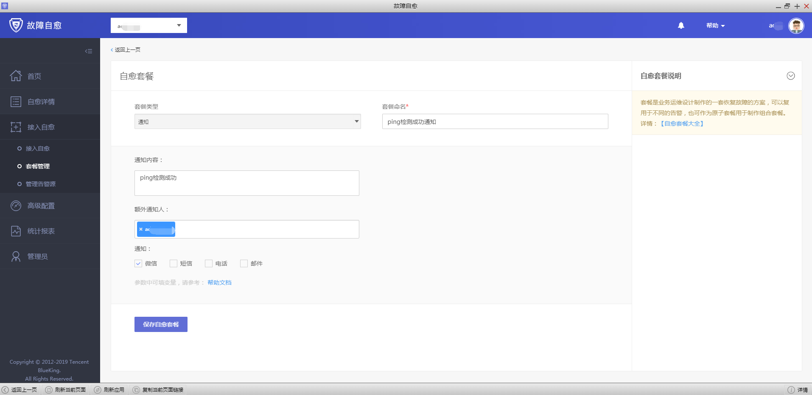
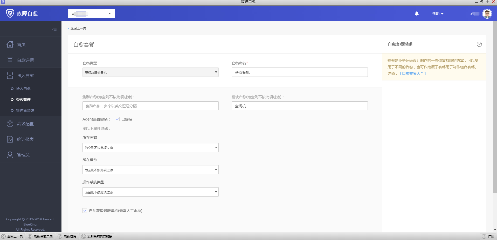
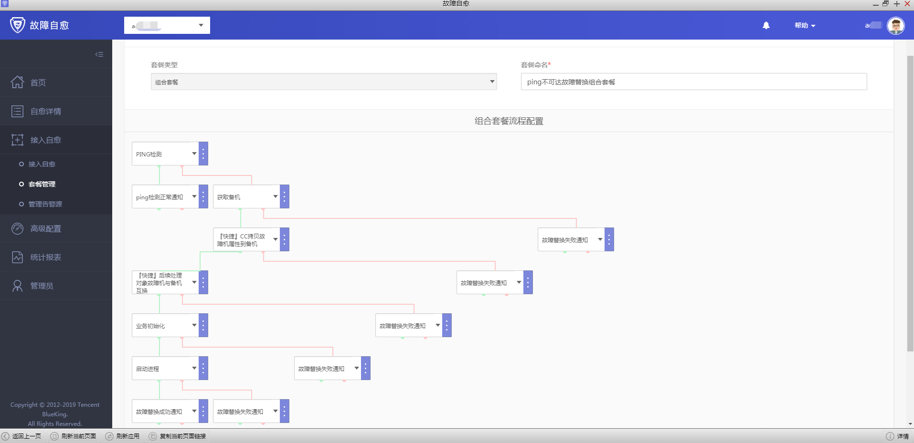
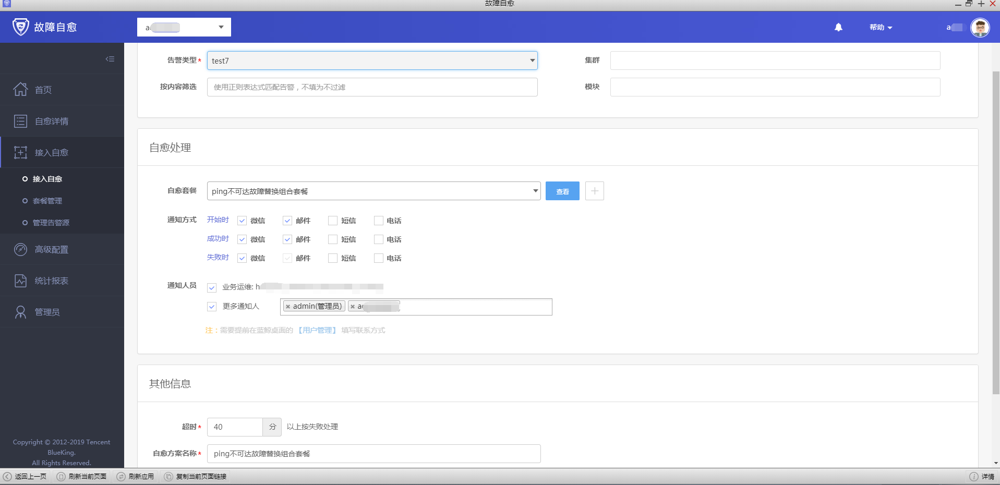
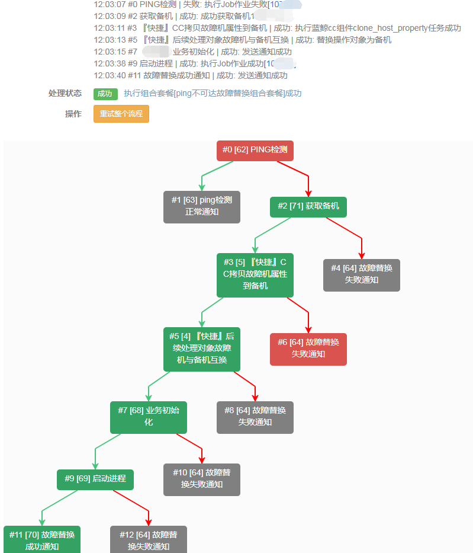

# 组合套餐在故障替换场景中的应用

## 情景

场景：A 模块是重要模块，出现 Ping 不可达告警，首先要校验 A 模块是否真的故障，如果真的故障，接下来是从资源池中获取备机 ... 故障替换等等，期间每个环节都有可能出错，那就要考虑异常分支的场景。

## 前提条件

- 需要先配置企业微信，注册链接：[企业微信首页](https://work.weixin.qq.com/) ，注意：开启微信端口 80443

- 蓝鲸故障自愈 APP 已经正常运行 创建故障自愈 APP 请参照 [微信审批接入流程](5.1/FTA/Scenes/WeChat_approval_access_process.md)。

## 1. 准备好组合套餐中每个原子（节点）的套餐

### 1.1 配置 Ping 检测的原子套餐

在作业平台写个简单的 Ping 检测脚本，再去故障自愈中配置 Ping 检测的自愈套餐。

### 1.2 通知 和 获取备机

Ping 检测没有异常，则发送正常通知。如 Ping 检测异常，则使用获取备机套餐，自动获取备机，前提是空闲机池中有空闲机。

- 配置 Ping 检测正常通知

-  配置自动获取备机套餐

### 1.3 拷贝故障机属性到备机

成功获取备机后，拷贝故障机属性到备机，后续处理对象故障机与备机互换，然后初始化业务，启动进程通知故障替换成功，以上步骤失败都加一个失败通知

- 『快捷』CC 拷贝故障机属性到备机、『快捷』后续处理对象故障机与备机互换，都是快捷套餐，只要选择就好，这里就不展开了。后面初始化业务请根据企业的初始化流程来配置初始化套餐，启动进程也是一样，因为这里只是模拟所以仅用通知代替。

## 2. 配置组合套餐，并接入故障自愈

接入故障自愈这里选择 REST 默认分类是为了方便触发告警，实际应用选择 Ping 不可达告警类型。

## 3. 触发告警，完成自愈

- 触发告警，由于这里是做测试，就不拿生产环境了，用 REST API 可以更方便的产生告警，完整流程请参照[REST API 推送](https://docs.bk.tencent.com/product_white_paper/fta/Getting_Started/Integrated_RestAPI_Push.html)。

- 回到故障自愈中，查看自愈详情，也可以点击状态，查看执行详情

