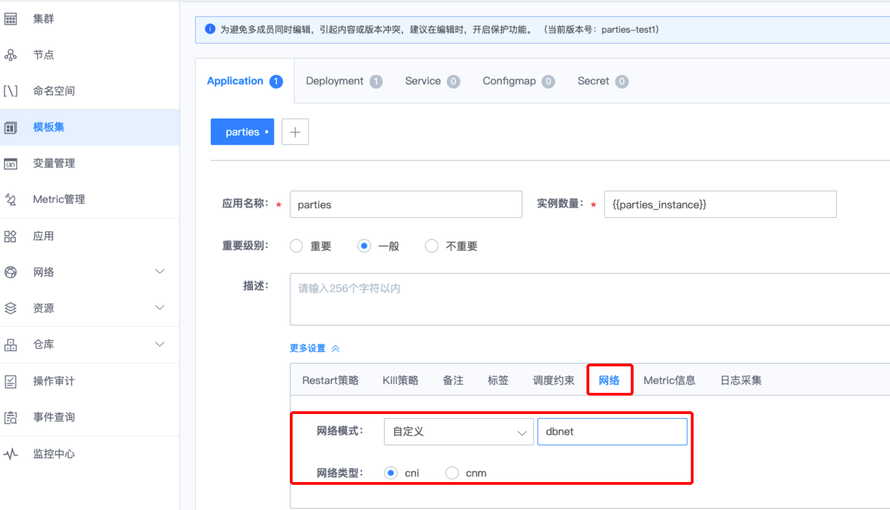

# BCS 自研 Mesos 容器方案网络集成

BCS 在设计 Mesos 方案之初已经考虑多种网络的集成问题。在容器 json 文件中有相关参数进行
网络参数详细设定。原始 json 文档可以参考

* [Application](https://github.com/Tencent/bk-bcs/blob/master/docs/templates/mesos-artifact/application.md)

关键参数说明

* networkType：容器网络标准，可选 cni 与 cnm
  * cnm：默认值，与 docker 网络集成时使用
  * cni：CNI 标准支持，支持基于 CNI 标准的所有插件
* networkMode: 容器网络模式
  * HOST：host 网络模式，需要和 cnm 组合，容器共享主机网络栈
  * BRIDGE：网桥模式，cnm/cni 标准皆可以支持
  * 自定义方式：docker 支持的其他网络模式、CNI 支持的插件皆可


## 1. 与 docker 集成

与 docker 网络集成时，application 的 json 配置 networkType 需要填写 cnm，默认即为该模式。

networkMode 的值则为 docker 已生效的网络模式，docker 网络模式查看：

```shell
$ docker network ls
NETWORK ID          NAME                DRIVER              SCOPE
437f2816be0a        bridge              bridge              local               
1093cd0625ed        host                host                local               
a1a0f9fbd969        none                null                local
```

其他自定义 docker 网络模式需要自行手动创建或对支持 CNM 模式的网络方案进行集成，例如 macvlan：

```shell
#创建macvlan，网络名字为test-macvlan
$ docker network create -d macvlan \
  --subnet=172.16.86.0/24 \
  --gateway=172.16.86.1 \
  -o parent=eth1 \
  test-macvlan
```

当使用 docker host、bridge 时，BCS 方案会针对 json 中填写的端口信息进行映射。例如 application 定义：

```json
"ports": [{
        "containerPort": 8090,
        "hostPort": 8090,
        "name": "test-tcp",
        "protocol": "TCP"
    }
]
```

映射方式说明：
* host 模式下，containerPort 即代表 hostPort
  * 填写固定端口，需要业务自行确认是否产生冲突
  * 填写 0，意味着 BCS 针对端口进行随机选择，端口实际值会写入环境变量中
* bridge 模式下，hostPort 代表物理主机上的端口
  * hostPort 填写固定端口，业务自行解决冲突的问题
  * 填写 0，BCS 默认进行端口随机
  * 小于 0，不进行端口映射

## 2. CNI 集成

BCS Mesos 方案默认支持 CNI 插件，使用 CNI 方案需要配置：

* CNI 目录，安装 BCS scheudler 时设置，默认为/data/bcs/bcs-cni
  * 二进制插件目录：/data/bcs/bcs-cni/bin
  * 配置目录：/data/bcs/bcs-cni/conf
* 部署 CNI 插件与配置到对应目录
* application 或 deployment json 中指定使用的网络插件

例如采用 macvlan

```json
"networkType": "cni",
"networkMode": "mymacvlan",
```

macvlan 插件配置：

```json
{
  "cniVersion": "0.3.0",
  "name": "mymacvlan",
  "type": "macvlan",
  "master": "eth1",
  "ipam": {
    "type": "bcs-ipam",
    "routes": [
      {"dst":"0.0.0.0/0"}
    ]
  }
}
```

## 3. 多网络集成

BCS Mesos 方案下的容器实现默认支持 CNI 链式调用方案。如要启动 CNI 链式调用，需要：

* CNI conf 目录下需要放置有链式调用配置
* CNI bin 目录下放置有所依赖的二进制文件

例如 CNI 配置:

```json
{
  "cniVersion": "0.3.1",
  "name": "dbnet",
  "plugins": [
    {
      "type": "bridge",
      "bridge": "cni0",
      "ipam": {
        "type": "host-local",
        "subnet": "10.1.0.0/16",
        "gateway": "10.1.0.1"
      }
    },
    {
      "type": "tuning",
      "sysctl": {
        "net.core.somaxconn": "500"
      }
    }
  ]
}
```

* 确保 CNI bin 目录下部署有 bridge 与 tunning 二进制文件
* 运行时依次调用 bridge 与 tunning 插件

调用该 CNI 配置时，Application 或 Deployment 需要明确填写：

```json
"networkType": "cni",
"networkMode": "dbnet",
```

## 4. SaaS 页面插件使用

完成插件配置后之后，在 bcs-saas 相关页面设置：

> 模板集--Application 设置--更多设置--网络，完成相关参数填写

> 如下图：


