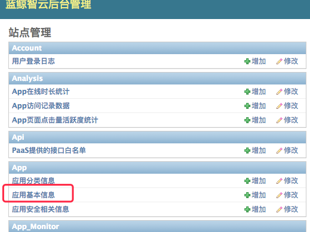
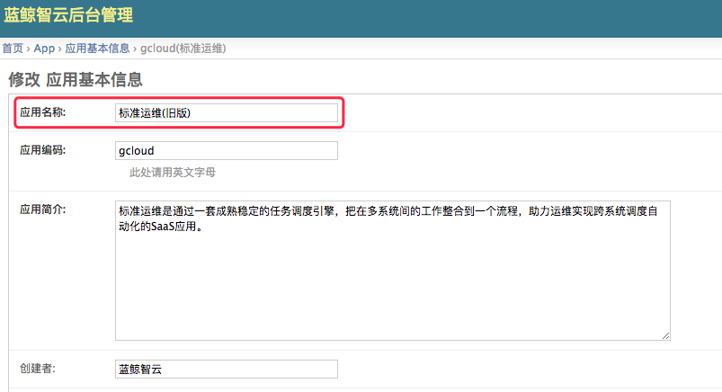
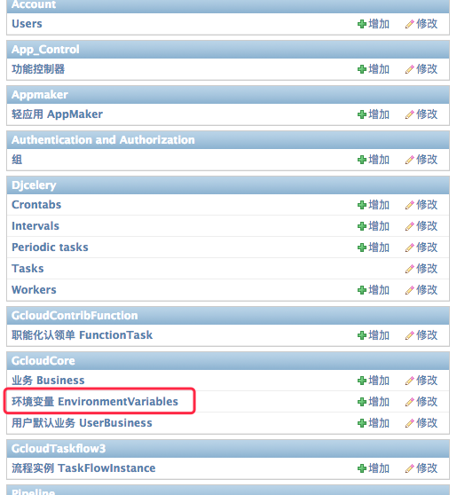

# 标准运维部署

## 修改旧版标准运维 APP 信息

如果之前未安装过标准运维(APP_CODE: gcloud)，可以直接跳过第一步，直接进入第二步。

假设你的蓝鲸桌面地址是 {BK_PAAS_HOST}/console/，那么请打开 "蓝鲸智云后台管理" 链接 {BK_PAAS_HOST}/admin/。



点击 【应用基本信息】 ，找到应用编码为 "gcloud" 的一行数据，点击应用名称 【标准运维】 进入编辑页面。修改应用名称为 "标准运维(旧版)" 后【保存】并退出 admin 页面。



## 开通 ESB 白名单

如果是全新版本部署蓝鲸，可以跳过这一步，直接进入第三步。
如果升级安装的蓝鲸，需要手动在中控机执行如下命令，开通标准运维访问 ESB 的白名单，以便标准运维原子可以正常调用 ESB 接口。
```bash
source /data/install/utils.fc
add_app_token bk_sops "$(_app_token bk_sops)" "标准运维"
```

## 准备 Redis 资源
联系部署同事在当前蓝鲸的运行环境找一台机器，新建一个 redis 服务账号和密码。也可以公用部署了蓝鲸已经部署的 redis 服务，需要注意多个应用公用一个 redis 服务可能存在 KEY 值冲突，并且无法保障标准运维服务的独立和可靠。

## 上传部署标准运维 APP
在开发者中心上传并部署新版的标准运维 APP。

## 修改标准运维环境变量配置

打开蓝鲸桌面 {BK_PAAS_HOST}/console/，在应用市场找到名字为 "标准运维" (APP_CODE: bk_sops) 的应用，添加到桌面并打开。

如果是企业版，请右键单击【业务首页】，选择在 "新标签页打开连接"。

修改浏览器链接为 {BK_PAAS_HOST}/o/bk_sops/admin/，打开标准运维管理后台页面。



找到【环境变量 EnvironmentVariables】并单击进入编辑页面。将第二步中准备的 redis 信息填写到环境变量配置中。即增加 3 条数据 `BKAPP_REDIS_HOST、BKAPP_REDIS_PORT、BKAPP_REDIS_PASSWORD`。

如果直接复用蓝鲸已经部署好的 redis 服务，环境变量可以分别配置为：
- BKAPP_REDIS_HOST=在中控机执行 source /data/install/utils.fc && echo $REDIS_IP 获取

- BKAPP_REDIS_PASSWORD=在中控机执行 source /data/install/utils.fc && echo $REDIS_PASS 获取

- BKAPP_REDIS_PORT=6379


## 重新部署标准运维 APP
由于环境变量只有在项目启动时才会加载，所以修改后必须重新部署才会生效，请进入开发者中心，找到 "标准运维"，点击重新部署。
