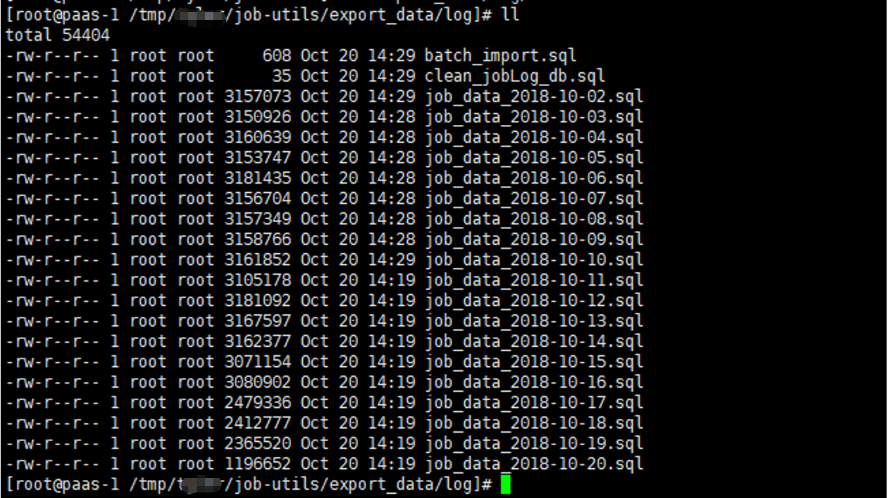

# 作业平台社区版日志迁移工具使用说明

## 功能

- 由于社区版 5.0.0 之前的作业执行日志是以文件的形式存放在磁盘上，而 5.0.0 版本之后的作业执行日志存放在 MySQL 中。本工具把日志文件导出成为 SQL 文件，通过执行 sql 脚本迁移执行日志数据到 DB 中。

## 使用说明

- 提供迁移工具 ce_job_migrate-bin.tgz，解压后目录如下：

  

- 说明：

  

- 具体的数据迁移步骤为：

  - 执行前检查。

  - 导出日志文件为 sql 脚本。

  - 升级 job 到新版本，启动之后验证功能正常。

  - 执行工具导出的 sql 脚本，导入原始数据到 db。

  - 数据迁移验证。

## 执行前检查

- 迁移数据之前需要保证：
  - 社区版 job 服务停止（避免产生新的数据和影响读取效率）

- 导出操作说明：

  - 上传 ce_job_migrate-bin.tgz 到社区版  job 服务器上，并解压缩。

  - 进入 job-utils 目录，使用 root 用户执行。

  - 

  - 

  - 脚本会提示输入导出数据的时间范围（作业执行的日志这个日期跟作业平台数据库迁移步骤中选择的时间范围保持一致），建议保留最近的执行日志，而不是全量导出。如果需要全量导出，直接回车即可；全量导出可能会导致导出导入比较耗时。

- 导出数据按照日志产生的日期存放在 job/utils/export_data/log 目录下面。

  - 

- 说明：

 - 

- 导入操作说明

  - 同步导出的 sql 文件到社区版中控机上（比如路径为/ tmp/job/export_data/log/
  - cd 到 /tmp/job/export_data/log/ 目录下(确保 MYSQL 命令行能够执行到当前路径下的 sql 文件)。然后登陆 MYSQL:
  - 

- 使用 MYSQL 命令行，切换到名称为 jobLog 的 schema 下:

  - 

- 初始化 job 的 db（jobLog，用于存储作业执行日志）。通过 MYSQL 命令行执行。

    ```bash
    source clean_jobLog_db.sql
    ```

- 导入数据，通过 MYSQL 命令行执行。
    ```bash
    source batch_import.sql
    ```
  >注意，必须保证执行过程中没有任何错误；如果出现错误，那么本次数据导入失败，需要分析原因再次清理数据后进行导入。

- 验证:
  - 启动作业平台服务器。

  - 检查历史执行作业，查看日志是否完整迁移。

  - 验证其他功能。
